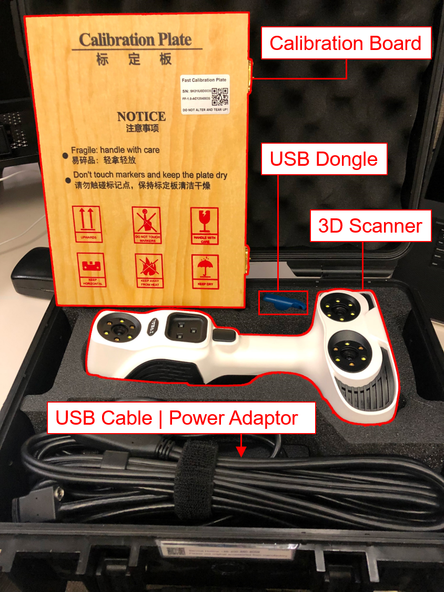
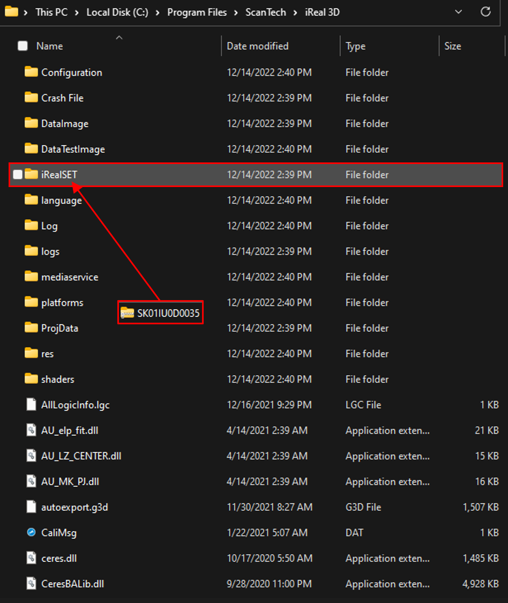

# iReal 3D Color Scanner (ScanTech)

## What's in the box

- iReal 3D Scanner
- USB Cable & Power Adaptor
- Calibration Plate
- USB Dongle
- Instructions


**Important**  
The installation files are stored on OneDrive. It requires JHID login to download the files.


## User Manual

[Click here](https://livejohnshopkins.sharepoint.com/:b:/s/PPMD/ESuJN-p5JT9Bqhbnli07r7UB0dY13Od8f-re45txV9g1EQ?e=2s0rKQ) to download the user manual.

Please read the user manual before using the scanner.

## Installation

### Download File

[Click here](https://livejohnshopkins.sharepoint.com/:u:/s/PPMD/EaELXi1eK-lCnuQGqsJAF8gBz_GvHJj1fqPgCQ7-lIWFSA?e=HRNMTo) to download the installation file.

### Instructions

Once the file is downloaded, you can start the installation by clicking **INSTALL**.

Now the iReal 3D scanner program has been successfully installed on your computer, before running the application, you need to copy the license file into your installation directory.

### Licensing


**Warning**  
You must be on [BIGSS Teams](https://teams.microsoft.com/l/team/19%3a853a20386bac40e59485fd8c98d80ad5%40thread.tacv2/conversations?groupId=11b0952a-e765-4985-abe3-73c17c99cb17) to have the permission to download the license file.


[Click here](https://livejohnshopkins.sharepoint.com/:u:/r/sites/PPMD/Shared%20Documents/General/Software%20Downloads/ScanTech/iReal/SK01IU0D0035.zip?csf=1&web=1&e=yQmpeM) to download the *compressed license file*.

Go to your installation directory (e.g. `C:\Program Files\ScanTech\iReal 3D`) and place the downloaded license file under the `iRealSET` folder.

Unzip the *compressed license file* into the `iRealSET` folder. (Place all the files directly under the folder.)

Done! Now your program is licensed.

## Instructions

### Get started

1. Connect the **Power Adaptor** to the **3D Scanner**.
2. Plug in the **USB Cable** into your computer (requires USB 3.0).
3. Plug in the **USB dongle** into your computer.

#### Calibration

Calibration is not necessary but recommended. It is normally performed when the device hasn't been used for a long time. Supposingly, the calibration would help improve the scanning accuracy.

Use the calibration plate located at the bottom of the case for calibration.

### Run the Application

1. Press the button on the scanner to start the **View** mode.
2. Press the button on the scanner again to start the **Scan** mode.
3. Save the scanned data as mesh files.

The 3D scanner application is straightforward to use. If you have any questions, please contact [Joshua Liu](mailto:jsliu@jhu.edu)