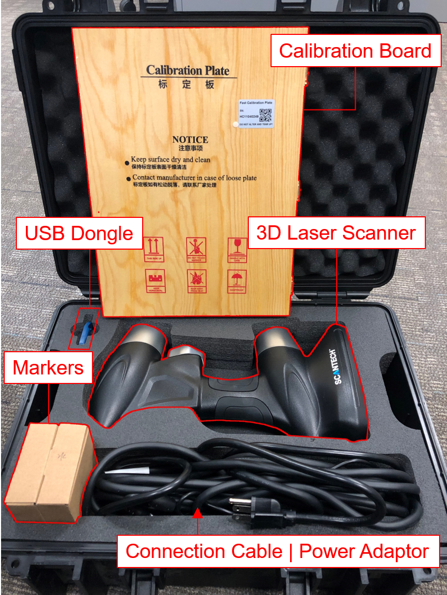
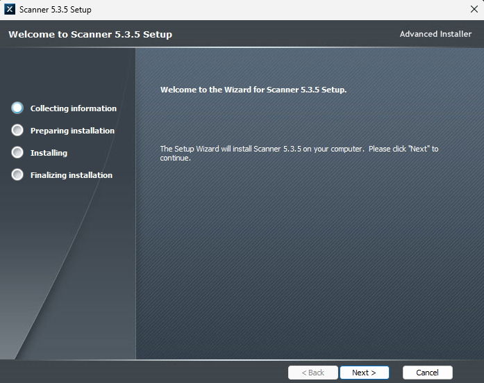
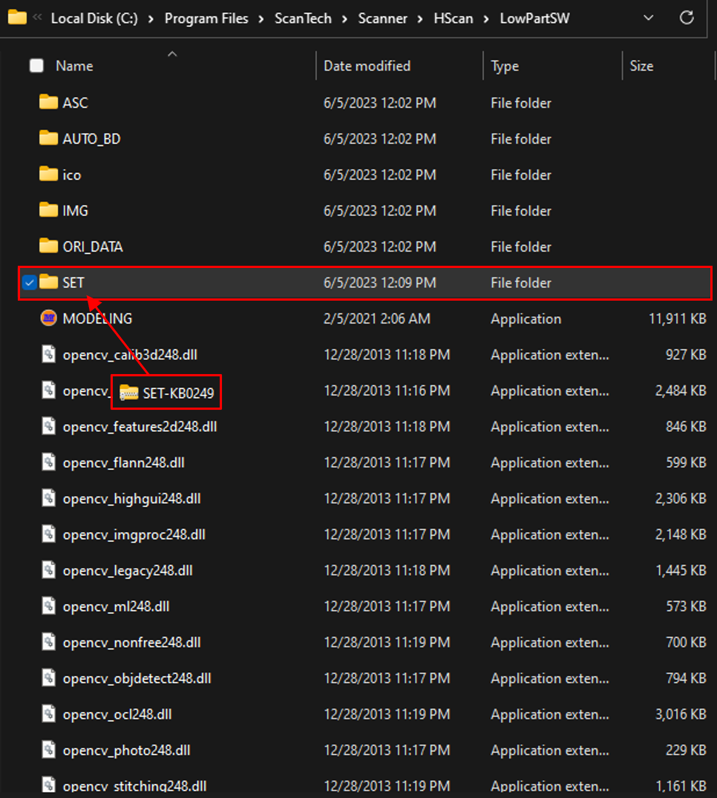
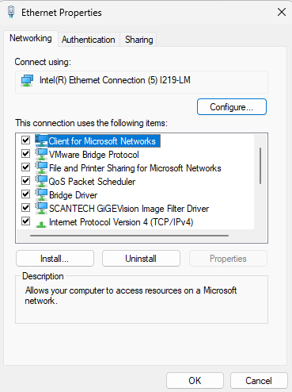
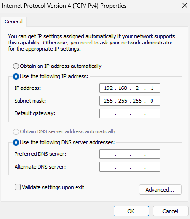
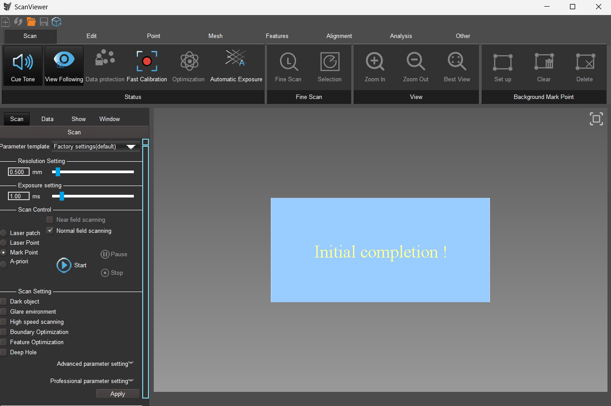

# Prince 335 Laser Scanner (ScanTech)

## What's in the box

- 3D Laser Scanner
- Connection Cable & Power Adaptor
- Calibration Plate
- USB Dongle
- Instructions


**Important**  
The installation files are stored on OneDrive. It requires JHID login to download the files.


## User Manual

[Click here](https://uark.sharepoint.com/:b:/r/teams/I3RTeam-BIGSS/Shared%20Documents/BIGSS/Software/ScanTech/Prince335/HSCAN%26PRINCE%203D%20scanner%20user%20manual%20V3.0.1.pdf?csf=1&web=1&e=Nhx2FZ) to download the 3D Scanner user manual.

[Click here](https://uark.sharepoint.com/:b:/r/teams/I3RTeam-BIGSS/Shared%20Documents/BIGSS/Software/ScanTech/Prince335/ScanViewer%20User%20Manual%20V5.3.5.pdf?csf=1&web=1&e=5zc6d7) to download the ScanViewer user manual.

Please read both user manuals before using the scanner.

## Installation

### Download File

[Click here](https://uark.sharepoint.com/:u:/r/teams/I3RTeam-BIGSS/Shared%20Documents/BIGSS/Software/ScanTech/Prince335/Scanner%20-%205.3.5%200401.exe?csf=1&web=1&e=kJ4AWR) to download the installation file (Scanner 5.3.5).

### Instructions

Once the file is downloaded, you can start the installation by clicking **Next>**.

Now the 3D scanner program has been successfully installed on your computer, before running the application, you need to copy the license file into your installation directory.

### Licensing


**Warning**  
You must acquire persission from [I3R](https://i3r.uark.edu/) to download the license file.


[Click here](https://uark.sharepoint.com/:u:/r/teams/I3RTeam-BIGSS/Shared%20Documents/BIGSS/Software/ScanTech/Prince335/SET-KB0249.zip?csf=1&web=1&e=1uPmyx) to download the *compressed license file*.

Go to your installation directory (e.g. `C:\Program Files\ScanTech\Scanner\HScan\LowPartSW`) and place the downloaded license file under the `SET` folder.

Unzip the *compressed license file* into the `SET` folder. (Place all the files directly under the folder.)

Done! Now your program is licensed.

## Instructions

### Get started

1. Connect the **Power Adaptor** to the **3D Scanner**.
2. Plug in the **Ethernet Cable** into your computer.
3. Plug in the **USB dongle** into your computer.

#### Configuration

1. Go to **Network and Internet Settings**
1. Go to **Ethernet Properties** and click **Configure...**

1. Go to **Advanced** tab
1. Set the **Jumbo Packet** to **9014 Bytes**
1. Set the **Speed & Duplex** to **1.0 Gbps Full Duplex**
1. Make sure the IP address is as following:

IP address: 192.168.2.1  
Subnet mask: 255.255.255.0
1. Done!

#### Calibration

Calibration is not necessary but recommended. It is normally performed when the device hasn't been used for a long time. Supposingly, the calibration would help improve the scanning accuracy.

Use the calibration plate located at the bottom of the case for calibration.

### Run the Application

1. Start the **XProgram** then open the **ScanViewer** application.

Please refer to the user manual for details how to use the 3D Scanner. If you have any questions, please contact [Joshua Liu](mailto:joshua.liu@uark.edu)