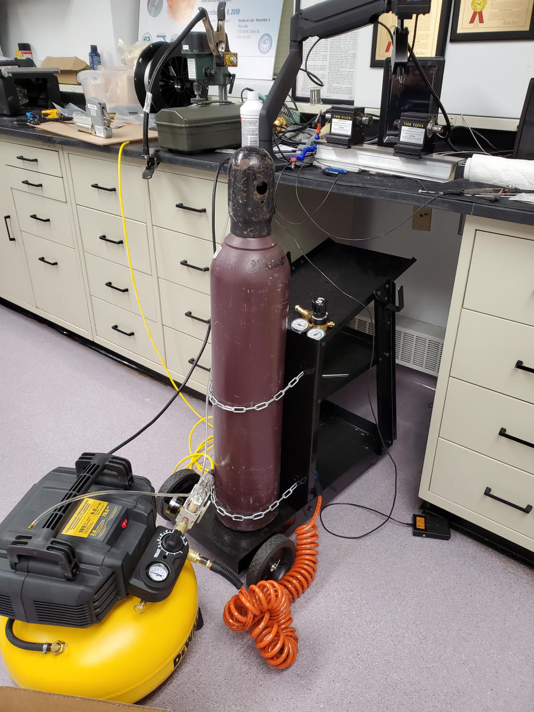

This following instruction is provided by [Justin Ma](mailto:jma60@jh.edu)

OSHA regulations: [https://www.osha.gov/laws-regs/regulations/standardnumber/1926/1926.350](https://www.osha.gov/laws-regs/regulations/standardnumber/1926/1926.350)

The tank can be rolled by hand or transported to the car with the rolling cart.  If the cart is used, make sure to remove any items from the shelves beforehand as the items can rattle out.  Please put the items back if any were removed.

Securing of the tank in the car is dependent on the size of the car. Seatbelts or straps can be used to help secure the tank vertically. 

The refill process:

1. Print out a copy of the JHU MD sales tax exemption form in case you get charged
2. Drive to the store and leave the tank in the car.
3. Go inside the showroom (building with glass windows) to the main counter
4. Say you’re a researcher from JHU and would like to get a tank of argon filled
5. If they ask for size, say you think its 120 ft^3
6. If they ask for your affiliation, say you’re with the engineering department
7. Pay/present the MD sales tax exempt form if necessary
8. Get the tank from the car and roll it to the garage next door to get it refilled
9. Bring the tank back to the car and load it
10. Drive car back to Bayview and unload the tank
11. Secure tank in rolling cart and place back in lab as the picture below shows:

You can call in advance to make sure they’re open, but they are a walk-in storefront.

**Earlbeck Gases & Technologies**
8204 Pulaski Hwy
Baltimore, MD 21237
[https://www.earlbeck.com/](https://www.earlbeck.com/)
(410) 687-8400