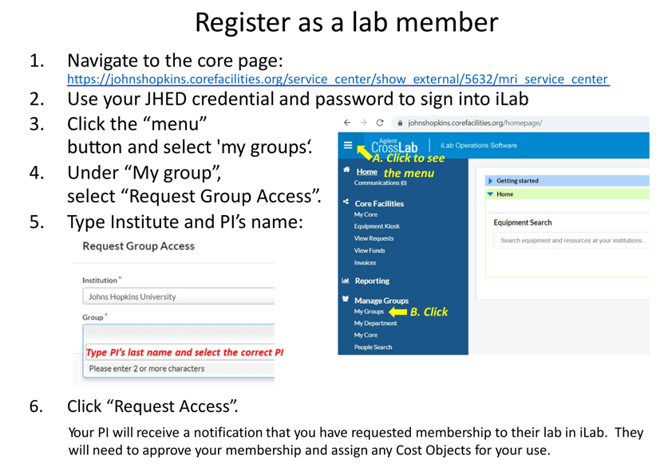

MRI Service Center
-------------

[MRI service center](https://www.hopkinsmedicine.org/radiology/research/service-cores/mri-service-center/) is located at Johns Hopkins Hospital. MRI scans could be taken here for research purposes.
The equipments available in the center are:
- [3T Siemens TIM Prisma MRI](https://www.siemens-healthineers.com/en-us/magnetic-resonance-imaging/3t-mri-scanner/magnetom-prisma)
- [1.5T short-bore Siemens Espree MRI](https://www.siemens-healthineers.com/en-us/refurbished-systems-medical-imaging-and-therapy/ecoline-refurbished-systems/magnetic-resoncance-imaging-ecoline/magnetom-espree-eco)
- [3T Philips Achieva MRI ](https://clinicalimagingsystems.com/product/philips-achieva-3-0t-mri-scanner/)

Please contact [Xinyuan Miao](xmiao5@jhu.edu) to setup the scanning protocol of the scan and the scheduling of the MRI scan.

Before the MRI scan, you should:

- submit "Request Access" on [iLab](https://johnshopkins.corefacilities.org/service_center/show_external/5632/mri_service_center) (https://johnshopkins.corefacilities.org/service_center/show_external/5632/mri_service_center) after the MRI model is decided.
- Discuss with Dr. Miao or MRI techs in the center regarding the scanning protocol and the scan duration.
- Complete MRI Safety training
  - Link to the training: https://godzilla4.kennedykrieger.org/mrsafety
  - To access the training, you must either be on the network in Johns Hopkins Hospital or on JHU VPN. Note that accessing the link using the hopkins WiFi from Homewood does not work. To acquire JHU VPN please visit: https://cds.johnshopkins.edu/vpn.
  - After the training, take the [Knowledge Assessment test](https://godzilla4.kennedykrieger.org/acct/mrsafety.pl?com=stst&type=0) and email your result to Dr. Miao.
- Schedule an MRI scan on [iLab](https://johnshopkins.corefacilities.org/service_center/show_external/5632/mri_service_center)

Detailed information regarding the MRI service center could be found here:

<object data="Welcome_package.pdf" type="application/pdf" width="100%" height="700px">
    <embed src="Welcome_package.pdf"></embed>
</object>