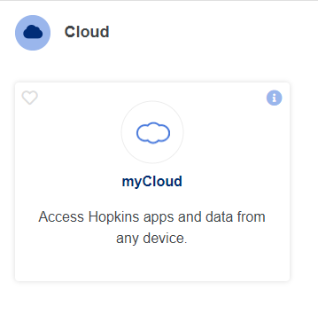
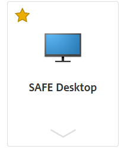
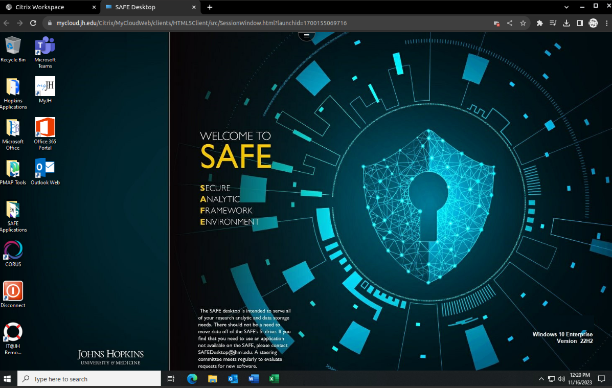
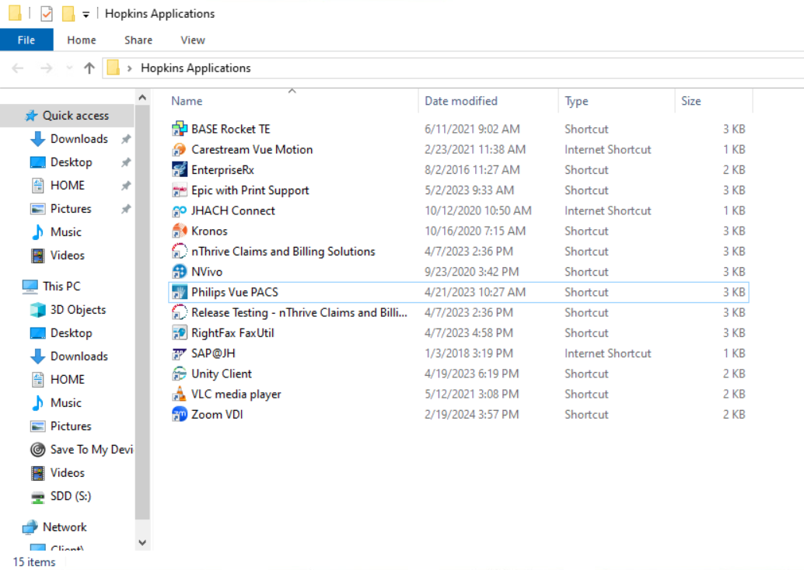
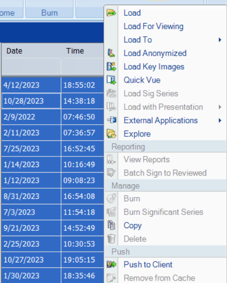
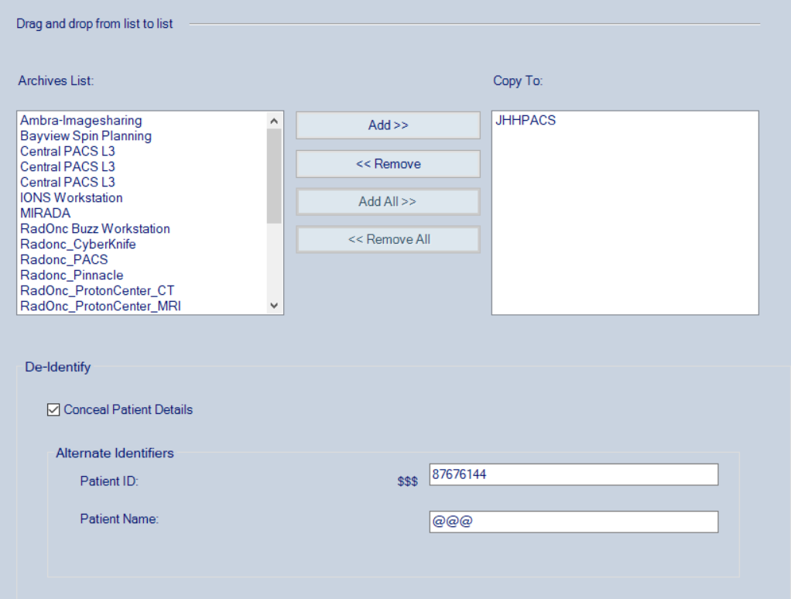

SAFE Desktop
-------------

SAFE Desktop is a computing environment designed to protect sensitive data for research involving confidential or regulated information, such as personal health information (PHI) or data subject to export controls. PHI and data acquired from Johns Hopkins Hospital from IRBs could usually be accessed through SAFE desktop remotely.

In order to access SAFE desktop, you need to complete [SAFE desktop request form](https://johnshopkins.service-now.com/serviceportal?id=sc_cat_item&sys_id=61fa28a26ffb220088e1f13f5d3ee45e).

Students would need faculty memebers to help with the application process of SAFE desktop.

Once the registration is succesful, head to [my.JH](https://my.jh.edu/html/myjh.html) and search for myCloud under APPS. 

  

  

You'll need to enter your JHU credentials to login the SAFE desktop. You will be provided with a project folder in the desktop where you can upload/access sensitive data.

PACS System
-------------

Picture Archiving and Communication System (PACS) ensures the security of patient data with the use of secure network protocols, data encryption, and compliance with healthcare regulations like HIPAA (Health Insurance Portability and Accountability Act). On SAFE Desktop, you will have access to Vue PACs system, which is a cloud based PACS system that enables remote access for diagnostic reading. It can be accessed under the Hopkins Application folder. The login creditials are identical to the JHED ID and your password.

You will have access to patient data in the PACS system. To de-identify them for further data processing, you need to create a new folder. You can then select the patient data from the database and copy them to the new folder, while copying the files, click on the "Conceal Patient Details" to ensure that the patient data are de-identified during the process. You can then access the de-identified data and export them to the workspace on SAFE desktop for research purposes.

