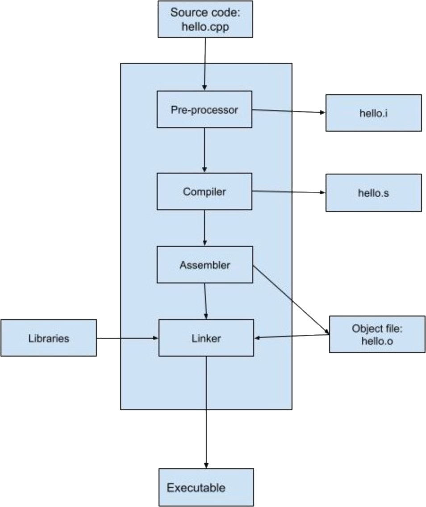

# Introduction to CMake

## Compiler

### Compilation Process

Example:

```cpp
// hellp.cpp

#include <iostream>

using namespace std;

int main(){
    // print message to console
    cout<<"Hello World!"<<endl;
    return 0;
}
```

If you do:

```bash
clang++ hello.cpp
```

under the hood, this compilation process performs 4 major steps:


* **Pre-process** `-E`:
* **Compile** `-S`:
* **Assembly** `-c`:
* **Link** `-o`:
<--->
- adding the contents of the header files
- pre-processed code --> assembly code
- assembly code --> binary code
- linking the binary code with all dependencies --> executable




### Libraries

a library file is a collection of precompiled code packaged up for reuse by other programs. There are two types of libraries:

 - **Static**
    - Faster, takes up more space (because a copy of static library becomes a part of every executable that uses it), becomes a part of end binary, named as lib*.a. Static libraries are archives just like zip/tar. Static libraries cannot be upgraded easily. To update a static library the entire executable needs to be replaced.
 - ***Dynamic**
    - Slower, can be copied, referenced by a program. Named lib*.so. When you compile a program that uses a dynamic library, the library does not become a part of your executable. It remains a separate unit. Dynamic libraries can be upgraded to a newer version without replacing all the executables that use it.

### Declaration and Definition

A common practice in C++ is to split up declaration and definition into two different source code files: **header file** and **implementation file**.

A C++ header file contains only **declarations**, whereas the implementation file consists of the **definitions**.

### Linking

Linking maps a function declaration to its compiled implementation, and takes the compiled object files or libraries --> combines them into a single executable. e.g.

```bash
clang++ -std=c++17 main.cpp -L . -lfirst -o main
```

With the `-L` flag, the linker searches a standard list of directories for the library plus the specified directory here `.` which means present directory. The `-l` option adds a library. In this examble we want to include a library called `libfirst`, so we use the flag `-lfirst`. At the end, it produces an executable file named `main`.

## Build System

Build Systems are tools that automate the build process. **Make** is an example of one of the most frequently used build systems. Make can be a standalone command-line application, but configuring build systems for a large project can be complex. For this, it's useful to get help from a build generator tool, such as **CMake**, to generate build files for Make.

### Build a CMake Project

```bash
cd <project_folder>
mkdir build
cd build
cmake ..
make
```

In the above commands you would replace `<project_folder>` with the name of the home folder where your program files are located.

Basic structure of a **CMakeLists.txt** file:

```cmake
#define the version of CMake you are using here 3.1
cmake_minimum_required(VERSION 3.1)
#project name
project(first_project)
#C++ version in use, here 17
set(CMAKE_CXX_STANDARD 17)

#tell CMake where to look for *.hpp ,*.h files
include_directories(include)

#create library "libbigss", this creates libbigss.a 
add_library(bigss src/bigss.cpp)

#add executable main, this creates main.o
add_executable(main src/main.cpp)

#tell the linker to bind these object files together and provide with the final executable
target_link_libraries(main bigss)
```

### ROS

For ROS 1, please refer to [catkin_cmake](https://catkin-tools.readthedocs.io/en/latest/).  
For ROS 2, please refer to [ament_cmake](https://index.ros.org/doc/ros2/Tutorials/Ament-CMake-Documentation/).