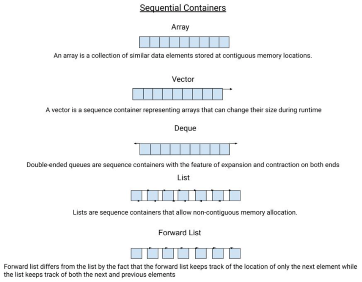
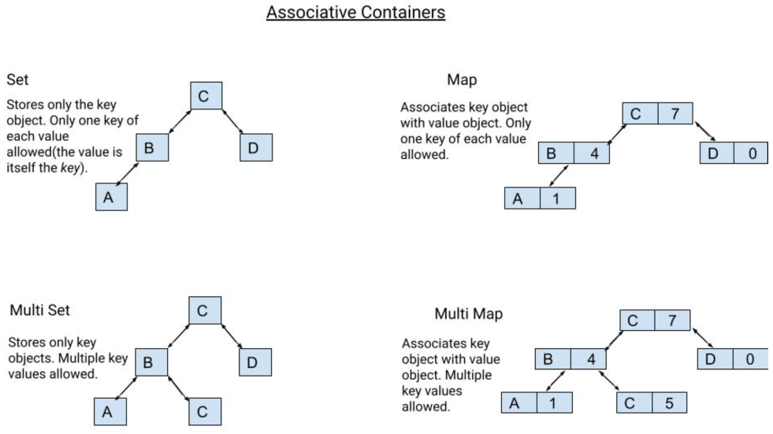
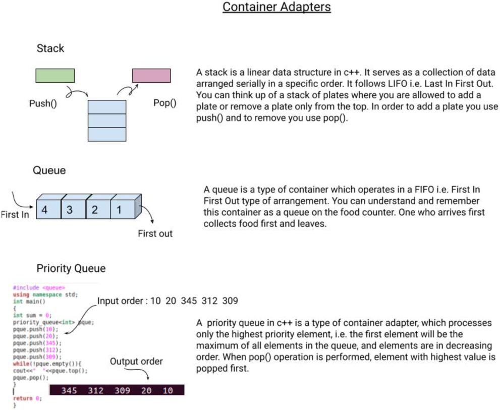

# The STL Library

STL is a library of C++ template classes to provide common programming data structures and functions. STL has 4 major components:

* Containers
* Iterators
* Algorithms
* Function Objects

## Containers

### Sequence Containers

### Associative Containers

### Unordered Containers

Unordered containers lack an order thus can be visualized as a bag filled with elements. Unordered elements use a hash function to map keys with their values.

### Container Adaptors

Container adaptors acts as an interface to provide functionality to pre-existing containers. They are implemented as a wrapper around another container.

## Array