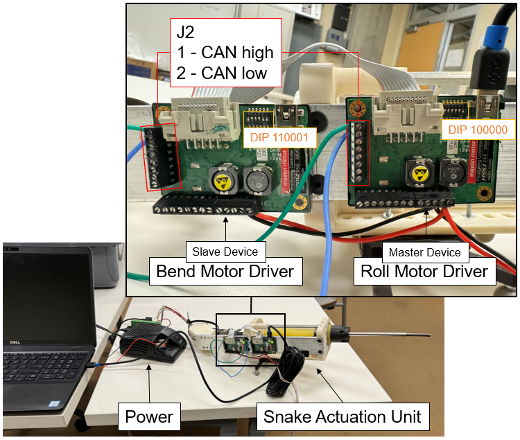

## Hardware Connection

The old snake actuation setup that is installed on UR5 in Hackerman 135 has two maxon motors, one for the roll motion and the other for bending the snake. Two maxon drivers are connected to the computer via one USB. One driver is configured as the master device and the other is configured as the slave device. The DIP switch settings are configured accordingly (refer to the [EPOS2 Hardware Reference](https://www.maxongroup.com/medias/sys_master/root/8834321383454/EPOS2-24-2-Hardware-Reference-En.pdf))

Clone the maxon EPOS2 ROS2 driver from [maxon_epos2_driver](https://github.com/jhu-bigss/maxon_epos2_driver) into your ROS2 workspace.