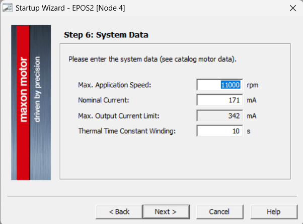
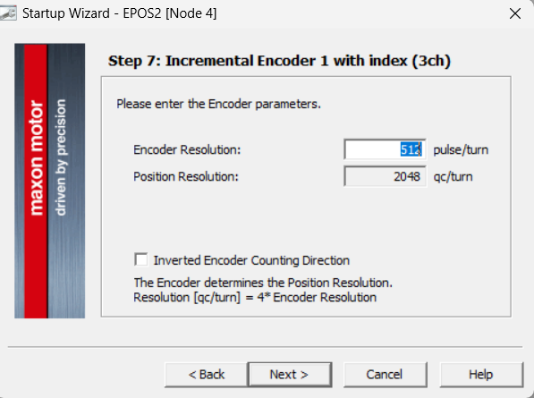
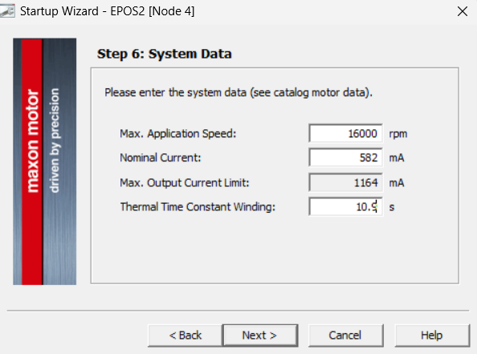
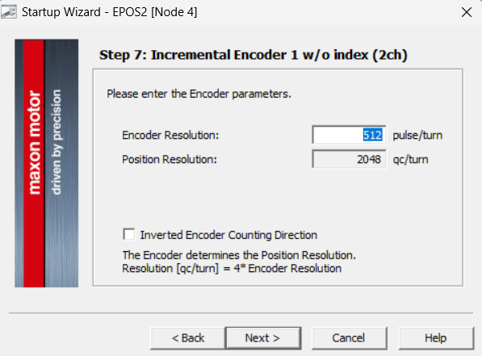

## Maxon Driver

We use Maxon [EPOS2 24/2, digital positioning controller, 2 A, 9 - 24 VDC](https://www.maxongroup.com/maxon/view/product/control/Positionierung/380264).

Download the [EPOS Studio](https://www.maxongroup.com/medias/sys_master/root/9123347169310/EPOS-2-4-IDX-Setup.zip) from the SOFTWARE/FIRMWARE under Downloads tab.

Install EPOS Studio and connect the Maxon driver to the computer via USB. Follow the [EPOS2 24/2 Getting Started](https://www.maxongroup.com/medias/sys_master/root/8834321317918/EPOS2-24-2-Getting-Started-En.pdf) to configure the driver.


## The CDM Actuation Unit

### The Roll Motor

| | Combination | Product NO. 526339|
| ------- | ------- | ----- |
| GEAR| Planetary Gearhead GP 16 C Ø16 mm, 0.2–0.6 Nm | Part number:416391|
| MOTOR| RE 16 Ø16 mm, Precious Metal Brushes CLL, 3.2 Watt| Part number:118705|
| SENSOR| Encoder MR, Type ML, 512 CPT, 3 Channels, with Line Driver| Part number:201940|

The Startup Configuration Parameters:





Afterwards, run the Regulation Tuning Wizard to tune the motor.
You can also **Export** the **Parameter** as a `dcf` file.

### The Bend Motor

| | Combination | Product NO. 466087|
| ------- | ------- | ----- |
| GEAR| Screw Drive GP 16 S Ø16 mm, Metric spindle, M6 x 1| Part number:424798|
| MOTOR| RE 16 Ø16 mm, Graphite Brushes, 4.5 Watt| Part number:118730|
| SENSOR| Encoder MR, Type M, 512 CPT, 2 Channels, with Line Driver| Part number:201937|

The Startup Configuration Parameters:





Afterwards, run the Regulation Tuning Wizard to tune the motor.
You can also **Export** the **Parameter** as a `dcf` file.

## Update the json file

Typically, once we have the exported parameters, we update the values of the json file that is used by ROS Driver.

For example, in [bigss/snake/config](https://git.lcsr.jhu.edu/bigss/snake/-/tree/dev_modernize/config), the json file `maxon_466087.json` looks like:

```json
{
"motor": {
    "motorParams": {
        "nominalCurrent": 582,
        "maxCurrent": 1164,
        "thermalTimeConstant": 109,
        "pitch": 1,
        "gearRatio": 24,
        "stroke": 200
        },
    "sensorParams": {
        "encoderResolution": 512,
        "quadrature": 4,
        "invertedPolarity": 0,
        "type": 2
        },
    "safetyParams": {
        "maxFollowError": 2000,
        "maxProfileVelocity": 12000,
        "maxAccel": 4294967295
        },
    "positionRegulator": {
        "p": 64,
        "i": 329,
        "d": 66,
        "vFF": 0,
        "aFF": 15
        },
    "velocityRegulator": {
        "p": 177,
        "i": 43,
        "vFF": 0,
        "aFF": 15
        },
    "currentRegulator": {
        "p": 732,
        "i": 469
        }
    }
}
```

Usually, you don't need to change the `motorParams`, `sensorParams` and `safetyParams` sections unless this is your first time creating a json configuration. The `positionRegulator`, `velocityRegulator`, and `currentRegulator` sections are the ones that you may need to update after tuning.